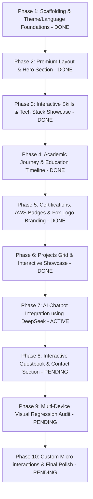

# Interactive Web Profile — Muhammad Ridho Azfa Karani

A premium, high-aesthetic web profile designed to showcase Ridho's qualifications (Information Systems student at University of Bakrie, SMK TKJ networking background, AWS certifications) and upcoming projects. It features full responsive support (Desktop, Tablet, Mobile), custom animations, a language toggle (English/Bahasa Indonesia), a theme toggle (Dark/Light mode, defaulting to Dark), and an integrated AI Chatbot.

**Branding Mascot:** The visual color scheme is themed around Ridho's uploaded Mascot Logo (glowing mint-green and emerald-cyan fox holding a neon sword).

---

## 🔒 Folder-Lock Constraint & Project Scope

> [!IMPORTANT]
> **Exclusive Directory Lock:** All source code files, configuration files, auxiliary scripts, build utilities, and project documentation (such as `task.md`, `walkthrough.md`, and `implementation_plan.md`) must reside exclusively within the folder:
> `c:/Developer/Hail Myself/Project/Web/portfolios/ridho-profile/`
>
> All terminal commands, testing scripts, and verification runs must be executed relative to this folder, avoiding modifications to global workspace configurations unless explicitly authorized.

---

## User Review Required

> [!IMPORTANT]
> **Active Focus: Phase 7 — AI Chatbot Integration using DeepSeek API**
>
> **1. API Route Proxy:**
> - Setup `/api/chat` route in Next.js to securely relay prompts to DeepSeek.
> - Inject a rich context payload containing Ridho's bio, skills, education, certifications, and case studies (Maryam Familia, Discover York, Characters 3D Viewer, Celeste AI) as system instructions.
>
> **2. Interactive Floating UI:**
> - Floating foxy dialog head toggler in the bottom right corner.
> - Responsive drawer styling that works beautifully on desktop, tablet, and mobile.
> - Fast-response suggest pills to jumpstart conversation.
>
> **3. Safe Fallback:**
> - In case of missing/invalid `DEEPSEEK_API_KEY`, a smart fallback responder simulates realistic, helpful answers using mock responses, rather than failing silently or throwing server errors.

---

## Open Questions

- We will configure the mock fallback to serve answers if `DEEPSEEK_API_KEY` is not provided in `.env`. Let us know if you want a mock database or simple static fallback prompts. We propose dynamic mock responses based on query keyword matching to ensure maximum interactivity in sandbox mode.

---

## 10-Phase Roadmap

---

## Proposed Changes — AI Chatbot Integration

### New Components

#### [NEW] [route.ts](file:///c:/Developer/Hail%20Myself/Project/Web/portfolios/ridho-profile/src/app/api/chat/route.ts)
A secure API route proxy that:
- Reads `DEEPSEEK_API_KEY` from the environment.
- Formulates a system message with Ridho's complete resume details (SMK TKJ, University of Bakrie, AWS Certifications, and Project Portfolio Details).
- Calls the DeepSeek API endpoint.
- Handles empty/invalid API keys gracefully with a local keyword-matching Mock AI processor.

#### [NEW] [Chatbot.tsx](file:///c:/Developer/Hail%20Myself/Project/Web/portfolios/ridho-profile/src/components/Chatbot.tsx)
A beautiful floating chatbot widget featuring:
- Emerald neon glowing fox icon overlay (mascot themed).
- Expandable glassmorphic dialog pane.
- Message list displaying user and assistant chat bubbles.
- Dynamic scrolling, message typing state animations, and error banners.
- Translation integration for multi-language context.
- Quick suggestion tags to speed up interactions.

### Modifications

#### [MODIFY] [en.ts](file:///c:/Developer/Hail%20Myself/Project/Web/portfolios/ridho-profile/src/locales/en.ts)
Add English translation dictionary keys for the chatbot:
- `chatbot.title`, `chatbot.placeholder`, `chatbot.welcome`, `chatbot.suggest_aws`, etc.

#### [MODIFY] [id.ts](file:///c:/Developer/Hail%20Myself/Project/Web/portfolios/ridho-profile/src/locales/id.ts)
Add matching Indonesian translations for the chatbot.

#### [MODIFY] [page.tsx](file:///c:/Developer/Hail%20Myself/Project/Web/portfolios/ridho-profile/src/app/page.tsx)
Mount the `<Chatbot />` component at the root level of the application page tree.

---

## Verification Plan

### Automated Tests
- Run `pnpm build` to compile the app and check for build boundaries.
- Run `pnpm lint` to verify zero type mismatches or tells.

### Manual Verification
- Test that clicking the chatbot bubble opens the dialog pane cleanly.
- Verify that clicking any suggestion tag immediately triggers a query response.
- Verify that toggling the language (EN/ID) immediately translates the chatbot UI, starter suggestions, and assistant greetings.
- Check console and network logs to ensure no leaked API keys or runtime crashes.
